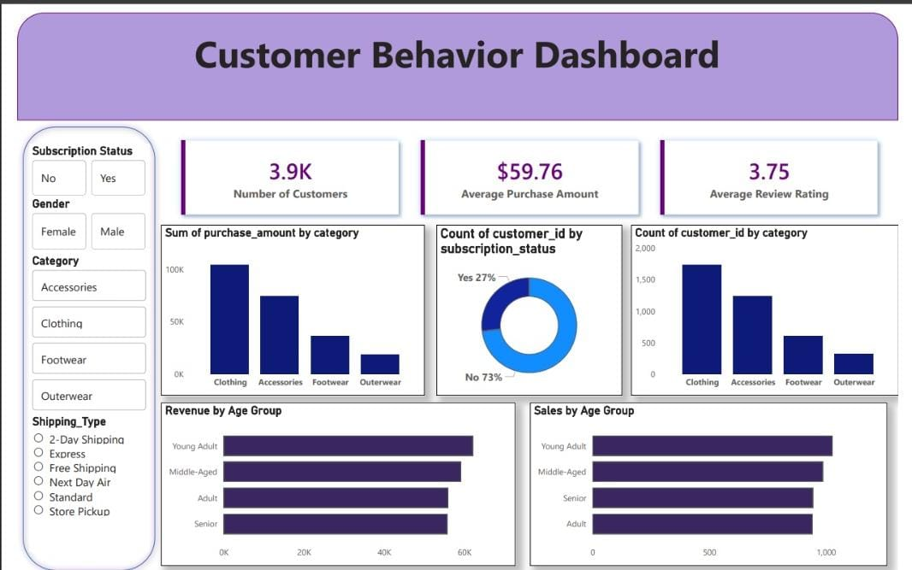

📊 Customer Behavior Analysis & Insights Dashboard
Project Title / Headline Customer Behavior Analysis Dashboard A professional, end-to-end data analytics project designed to uncover shopping trends, analyze customer demographics, and optimize retail strategies through data-driven insights.

Short Description / Purpose This project simulates a real-world corporate workflow by analyzing a comprehensive retail dataset. It aims to help management understand shifts in purchasing patterns across different demographics and product categories, specifically looking at how factors like discounts, reviews, and payment preferences drive repeat purchases.

Tech Stack The project utilizes a full-stack data analytics workflow:

Python (Pandas) – Used for initial data cleaning, exploratory data analysis (EDA), and feature engineering (e.g., creating age groups and mapping purchase frequencies).

PostgreSQL – The primary database used to store cleaned data and perform advanced analysis through complex SQL queries.

SQLAlchemy – Facilitated the connection and data transfer between Python and the SQL database.

Power BI Desktop – Used to build an interactive, high-contrast dashboard for visualizing KPIs like revenue by category and customer distribution.

DAX (Data Analysis Expressions) – Employed to create custom measures such as "Average Purchase Amount" and "Number of Customers".

Data Source

Source: Synthetic Retail Customer Shopping Behavior Dataset.

Structure: Includes unique Customer IDs, demographic data (Age, Gender, Location), and transactional details (Item Purchased, Category, Purchase Amount, Season, Review Rating, and Subscription Status).

Features / Highlights

Business Problem: A leading retail company needed to understand changing consumer decisions to improve long-term loyalty and sales.

Advanced Data Cleaning: Implemented category-specific median imputation for missing review ratings to maintain data integrity.

Customer Segmentation: Used SQL window functions and CTEs to segment the workforce into "New," "Returning," and "Loyal" categories.

Interactive Visuals:

Revenue & Sales Overview: KPI cards for quick executive summaries.

Revenue by Age Group: A bar chart identifying the most valuable demographic segments (e.g., Young Adults).

Subscription Impact: A donut chart comparing the percentage of subscribed versus non-subscribed customers.

Dynamic Filtering: Slicers for Gender, Category, and Shipping Type to allow for deep-dive analysis.

Business Impact & Insights

Marketing Optimization: Identifying top-rated products (like Gloves and Sandals) to highlight in premium campaigns.

## Project Screenshot

Shipping Strategy: Data revealed that Express Shipping customers have a higher average spend, suggesting a need for investment in faster delivery.

Promotional Effectiveness: Analyzing the "Discount Rate" per product to see which items rely too heavily on sales to move inventory.

